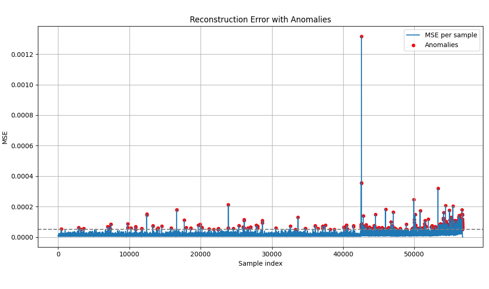

# Real-Time Anomaly Detection for Vibration Data using 1D CNN Autoencoder

This project implements an autoencoder-based anomaly detection system for identifying abnormal machine behavior from vibration data. It is designed to work in real-time and is lightweight enough for deployment on edge devices such as Raspberry Pi and NVIDIA Jetson.

## Overview

- **Goal**: Detect anomalies in time-series vibration signals from industrial machinery.
- **Method**: Train a 1D convolutional autoencoder to reconstruct normal patterns and flag high reconstruction error as anomalies.
- **Deployment**: Optimized for real-time performance and exportable to ONNX, TorchScript, and TensorRT formats.

## Features

- Low-latency inference suitable for edge devices
- Real-time anomaly flagging using a threshold on reconstruction error
- Live visualization of vibration signals and anomaly status
- Offline evaluation and statistical thresholding
- Multiple model export formats for deployment flexibility

## Results

The model was evaluated using the IMS bearing dataset. A fixed threshold was selected based on the MSE distribution on the test set.

### Performance

- **Total anomalies detected**: 814
- **Average inference latency**: ~0.1–0.3 ms per sample on M3 MacBook Air
- **Max latency (single sample inference)**: ~15.8 ms

### Reconstruction Error Plot

The figure below visualizes the reconstruction error per sample with anomalies highlighted.

## Current Limitations

- The model aggregates all axis channels into a single input; axis-specific insights are not extracted.
- It only answers “Is the machine behaving normally?” – no diagnostics or prognosis is included.
- No classification of fault types or degradation tracking over time.

## Future Work

- Extend to fault classification (diagnostics) using supervised labels
- Incorporate Remaining Useful Life (RUL) estimation (prognostics)
- Train on individual sensor axes for more granular insight
- Integrate with real-time industrial data pipelines or SCADA systems
- Quantize and optimize further for ultra-low power devices

## License

This project is released under the MIT License.

## Acknowledgements

- IMS Bearing Dataset from the NASA Acoustics and Vibration Lab
- PyTorch for model development
- Matplotlib for visualization
